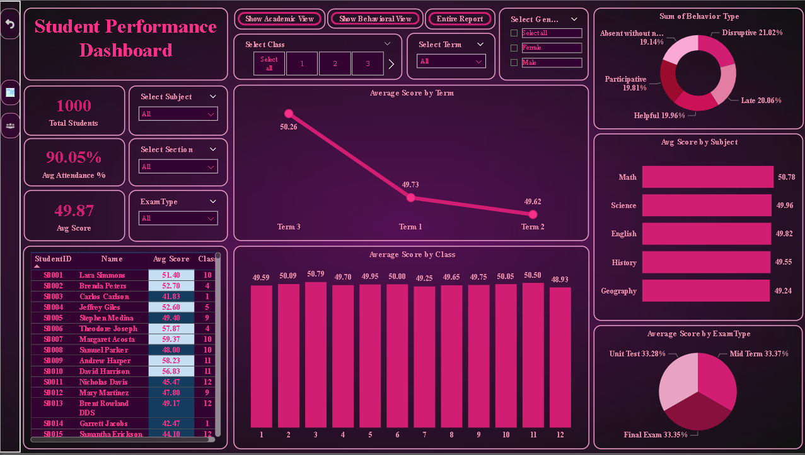

# 📊 Student Performance Dashboard – README

## 📁 Project Title  
**Student Performance Dashboard**

## 📌 Objective  
The primary goal of this Power BI dashboard is to provide a comprehensive visual overview of student academic performance and attendance. It enables educational institutions and administrators to monitor key performance indicators (KPIs), identify underperforming students, and take data-driven decisions to improve student outcomes.

---

## 🧩 Data Model Overview  
The data model includes the following main tables:

1. **Student**  
   - `Student ID`  
   - `Name`  
   - `Class`  
   - `Gender`  

2. **Scores**  
   - `Student ID`  
   - `Subject`  
   - `Marks Obtained`  
   - `Maximum Marks`  

3. **Attendance**  
   - `Student ID`  
   - `Date`  
   - `Attendance Status` (Present/Absent)
  
4. **Behavior**  
   - `Behavior type`  
   - `Behavior count per type`

---

## 📈 Key Metrics & Visuals

### 🔹 KPIs (Card Visuals)  
- **Total Students**  
- **Average Attendance %**  
- **Overall Average Score %**

### 🔹 Bar/Column Charts  
- **Average Score by Subject**  
- **Attendance by Student**  
- **Score Distribution (Below 40%, 40-60%, Above 60%)**

### 🔹 Conditional Formatting Table  
- **Student-wise Score Table**  
  - Green: Above 60%  
  - Yellow: 40–60%  
  - Red: Below 40%

### 🔹 Filters & Slicers  
- Class Filter  
- Subject Filter  
- Gender Filter  
- Score Range Filter

---

## ⚙️ Features Implemented

- **Drill-through functionality** to see individual student details.
- **DAX Measures** to calculate:
  - Average Score
  - Attendance %
  - Score Category Counts
- **Conditional Formatting** applied for quick performance assessment.

---

## 🧠 Business Insights Derived

- Identify students who consistently score below passing marks.
- Analyze subject-wise performance trends.
- Track attendance patterns and correlate with academic scores.
- Compare performance between genders and classes.

---

## 📌 Usage Instructions

1. Open the `.pbix` file using Power BI Desktop.
2. Use filters/slicers to view data for specific subjects, classes, or student groups.
3. Click on visuals to interact and drill through detailed information.

---

## 🔧 Technical Stack

- **Tool:** Microsoft Power BI  
- **Data Sources:** Static tabular data loaded within Power BI  
- **Data Transformation:** Power Query Editor  
- **DAX Functions:** `CALCULATE`, `AVERAGEX`, `COUNTROWS`, `FILTER`, etc.

---

## 📝 Author  
**Prepared by:** Mihir Limje  
**Date:** June 2025  
**Version:** 1.0
